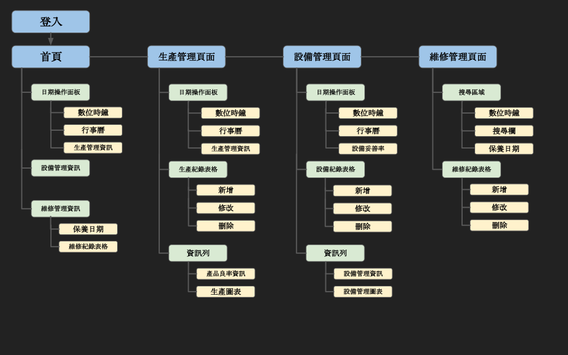
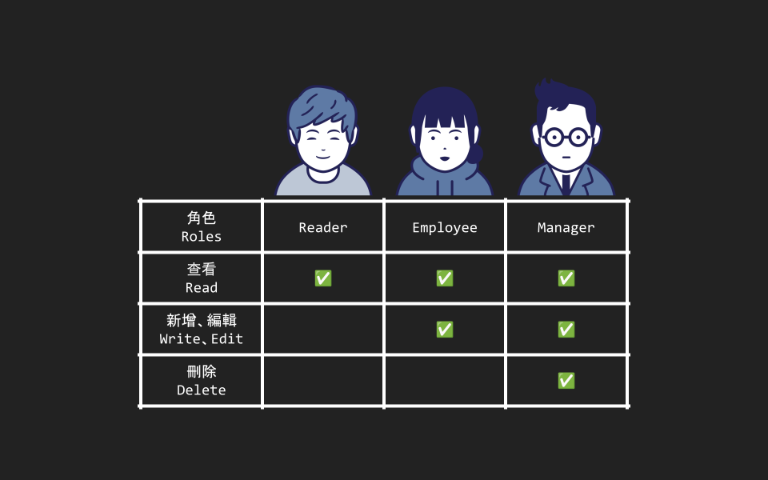

# 3D列印機設備管理面板

一個用來管理多台3DP列印機的網站，而且可以依照現場機器狀況來規劃生產計劃表，查看與監測每日列印機機況，及紀錄列印機維修狀況。

A website for managing 3DP printers and planning production schedules, monitoring daily printer conditions and registering printer maintenance records.

## 試用 Demo

請點擊連結 [https://dp-react-firebase.web.app/](https://dp-react-firebase.web.app/) 試用 demo

示範用帳號密碼 

```bash
帳號： reader1@gmail.com
密碼： 00001234
```

## 安裝

以下將會引導你如何安裝此專案到你的電腦上。

Node.js 版本建議為：`v20.11.1` 以上...

### 取得專案

```bash
git clone https://github.com/zoewang7512/3D-Printer-Dashboard.git
```

### 移動到專案內

```bash
cd 3D-Printer-Dashboard
```

### 安裝套件

```bash
npm install
```

### 運行專案

```bash
npm start
```
### 發佈專案

```bash
npm run build
```

```bash
firebase deploy
```

## 網站地圖 Sitemap




## 資料庫層級角色 Database-level roles



## 專案技術

- Node.js v20.11.1
- react v18.3.1
- react-bootstrap v2.10.3
- react-router-dom v6.23.1
- Axios v1.7.2
- firebase v10.12.2

